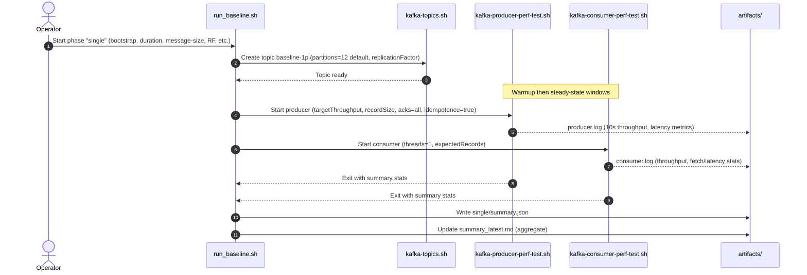
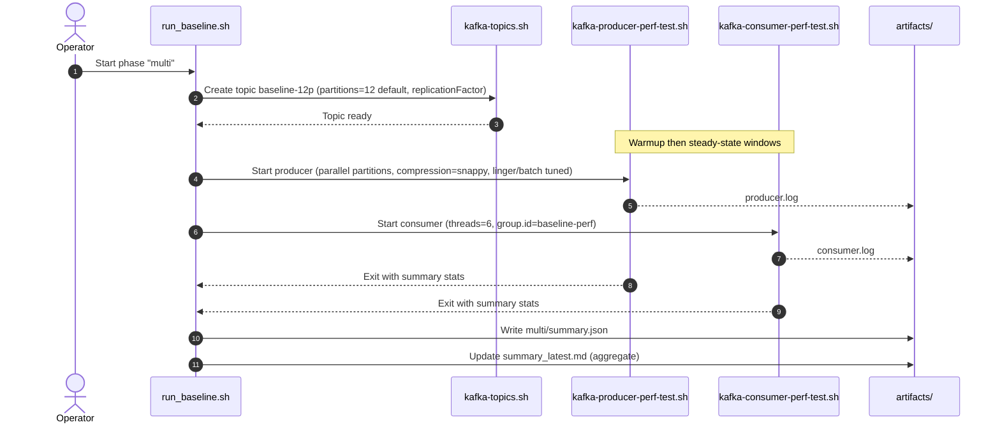
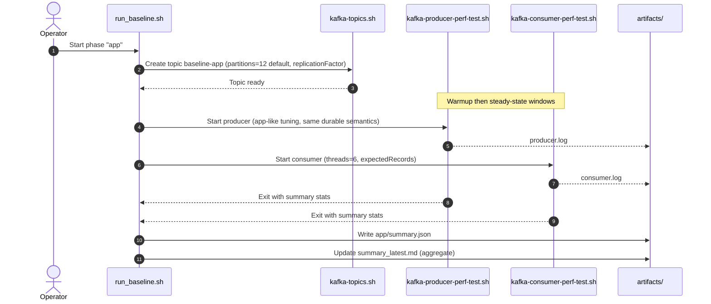

## Kafka Baseline Performance Toolkit

This repo bundles two runnable implementations of the baseline design in `docs/kafka-baseline-perf.md`:

1. **CLI runner** – wraps Apache Kafka’s native `kafka-producer-perf-test.sh` + `kafka-consumer-perf-test.sh`.
2. **Spring runner** – a Spring Kafka workload that mirrors the same phases/end-to-end metrics but closer to real application consumers/producers.

---

### Repository Layout

| Path | Purpose |
|------|---------|
| `runners/cli/scripts/run_baseline.sh` | Orchestrates topic creation, producer & consumer perf tests, and artifacts per phase. |
| `runners/cli/config/baseline-consumer.properties` | Base consumer config appended to each CLI run; override with `--client-config` for secure clusters. |
| `runners/cli/docker/` | CLI runner image (Temurin JRE + Kafka CLI + scripts). |
| `runners/spring/` | Spring Kafka app (Gradle/JDK21). Message flow lives in `BaselineProducer` (sends JSON payloads) and `BaselineConsumer` (polls, tracks latency). |
| `docker-compose.yml` | Runs the tooling container with the repo mounted into `/workspace`. |
| `charts/kafka-perf-runner/` | Helm chart for the CLI runner job. |
| `charts/kafka-perf-spring/` | Helm chart for the Spring runner job. |
| `docs/kafka-baseline-perf.md` | Full design document (principles, metrics, automation template, storage planning). |
| `artifacts/` | Output logs per run (`<timestamp>_<phase>/.../summary.json`) plus `summary_latest*.md`. |

---

### Prerequisites

- Docker + Docker Compose Plugin.
- Access to a Kafka cluster (bootstrap servers, credentials if secured).
- Optional: local Kafka CLI binaries if you want to run `runners/cli/scripts/run_baseline.sh` directly on your host.
- JDK 21 (the Docker images use Eclipse Temurin 21 for both runners).

---

### Quick Start (Docker Compose)

#### A. Launch local Kafka stack (optional)

Need a sandbox cluster? The Compose file now bundles the official **Apache Kafka 3.8.0** container running in single-node KRaft mode:

```bash
docker compose up -d kafka
```

Host apps can reach it via `localhost:9092`. Containers in the Compose network should use `kafka:9094` (the internal listener). Override `KAFKA_CLUSTER_ID` in `.env` if you need a specific cluster UUID; the default (`4L6g3nShT-eMCtK--X86sw`) works for local testing. Tear down with `docker compose down`.

#### B. Build runner images

```bash
# Build both runner images
docker compose build perf-runner spring-runner

# CLI runner: local single-node sanity check (1 partition, replication 1)
BOOTSTRAP_SERVERS="kafka:9094" \
  docker compose run --rm perf-runner \
  ./runners/cli/scripts/run_baseline.sh --phase single --replication-factor 1

# CLI runner: full baseline against real clusters (multi partitions, replication 3)
BOOTSTRAP_SERVERS="broker1:9092,broker2:9092,broker3:9092" \
  docker compose run --rm perf-runner \
  ./runners/cli/scripts/run_baseline.sh --phase all --replication-factor 3

# Spring runner: app-style workload vs. local broker
docker compose run --rm spring-runner \
  --baseline.bootstrap-servers=kafka:9094 \
  --baseline.duration-seconds=180 \
  --baseline.replication-factor=1
```

When using the local broker, keep `BOOTSTRAP_SERVERS=kafka:9094` inside Compose (or `localhost:9092` when running the script directly on your host). Override the variable with your real bootstrap list to target external clusters.

Artifacts are written under `artifacts/` on your host. Remove the container afterward (`docker compose down`); the logs remain in the workspace.

---

### Usage At A Glance

- **CLI runner (Kafka perf scripts)**
  - Local validation: `docker compose run --rm perf-runner ./runners/cli/scripts/run_baseline.sh --bootstrap kafka:9094 --phase single --replication-factor 1`
  - Full baseline vs Strimzi: same command with `--phase all --replication-factor 3` and `BOOTSTRAP_SERVERS=my-cluster-kafka-bootstrap.kafka.svc.cluster.local:9092`
  - Kubernetes/CI: build via `runners/cli/docker/Dockerfile`, install `charts/kafka-perf-runner`
- **Spring runner (app-style workload)**
  - Local validation: `docker compose run --rm spring-runner --baseline.bootstrap-servers=kafka:9094 --baseline.duration-seconds=300 --baseline.replication-factor=1`
  - Kubernetes/CI: build via `runners/spring/docker/Dockerfile`, install `charts/kafka-perf-spring`

Pick the runner that matches your environment, then collect artifacts either from the local `artifacts/` directory or from the Kubernetes PVC/logs.

---

### Deploy the CLI Runner via Helm

Use `charts/kafka-perf-runner` when you want to run the perf-test CLI inside a cluster (e.g., namespace `kafka-perf-test`) against a Strimzi-managed Kafka endpoint.

1. **Build and push the image (includes scripts + Kafka CLI).**
   ```bash
   docker build -t registry.example.com/kafka-perf-runner:latest -f runners/cli/docker/Dockerfile .
   docker push registry.example.com/kafka-perf-runner:latest
   ```
2. **Install the chart (creates a one-shot Job).**
   ```bash
   helm install kafka-baseline charts/kafka-perf-runner \
     --namespace kafka-perf-test --create-namespace \
     --set image.repository=registry.example.com/kafka-perf-runner \
     --set image.tag=latest \
     --set bootstrapServers=my-cluster-kafka-bootstrap.kafka.svc.cluster.local:9092 \
     --set runner.phase=all \
     --set runner.replicationFactor=3
   ```
3. **Optional settings**
   - `--set artifacts.pvcName=<pvc>` to persist `artifacts/summary_latest.md` and log files.
   - `--set runner.duration=600`, `runner.messageSize=4096`, etc. to override defaults.
   - `--set clientConfigSecret` / `commandConfigSecret` to mount SASL/SSL configs from Kubernetes secrets.

The Job uses the same `runners/cli/scripts/run_baseline.sh` entry point and logs to `/workspace/artifacts` inside the pod. Fetch results via `kubectl logs job/kafka-baseline` or by downloading the PVC contents.

- **Collecting summaries in Kubernetes**  
  - Tail the job logs for the CLI runner to see the perf-test output in real time:  
    `kubectl logs job/kafka-baseline` (look for lines such as `14400000 records sent, 19999.777780 records/sec (19.53 MB/sec), 1.26 ms avg latency, 259.00 ms max latency, 1 ms 50th, 4 ms 95th, 5 ms 99th, 10 ms 99.9th`).  
  - If you mounted a PVC, copy the aggregated Markdown/JSON summaries back with `kubectl cp kafka-perf-test/<pod>:/workspace/artifacts ./artifacts-k8s`.

---

### Script Options

```bash
./runners/cli/scripts/run_baseline.sh --bootstrap host1:9092[,host2:9092,...] [flags]

Flags:
  --phase single|multi|app|all  # default all
  --duration <seconds>          # steady-state window (default 600)
  --message-size <bytes>        # default 1024
  --client-config <path>        # extra producer/consumer props (SASL/SSL)
  --command-config <path>       # admin (topic) client config
  --replication-factor <n>      # topic replication factor (default 3)
  --dry-run                     # print commands only
```

### Run it locally to verify the workflow
```bash
# CLI (script) runner: single phase example
docker compose run --rm perf-runner \
  ./runners/cli/scripts/run_baseline.sh --bootstrap kafka:9094 --phase single --replication-factor 1

# Spring runner: single phase example
docker compose run --rm spring-runner \
  --baseline.bootstrap-servers=kafka:9094 \
  --baseline.phases[0].name=single \
  --baseline.replication-factor=1

# Spring runner: low-load smoke test (quotes avoid zsh globbing on [] args)
docker compose run --rm spring-runner \
  --baseline.bootstrap-servers=kafka:9094 \
  --baseline.duration-seconds=45 \
  --baseline.replication-factor=1 \
  '--baseline.phases[0].name=single' \
  '--baseline.phases[0].topic=baseline-1p' \
  '--baseline.phases[0].partitions=1' \
  '--baseline.phases[0].target-throughput=500' \
  '--baseline.phases[0].consumer-threads=1'

# CLI (script) runner: all phases example
docker compose run --rm perf-runner \
  ./runners/cli/scripts/run_baseline.sh \
    --bootstrap kafka:9094 \
    --phase all \
    --replication-factor 1

# Spring runner: all phases example
docker compose run --rm spring-runner \
  --baseline.bootstrap-servers=kafka:9094 \
  --baseline.replication-factor=1
```
Set `BOOTSTRAP_SERVERS` env var to avoid passing `--bootstrap` explicitly. When using Compose, mount any custom config files under the repo so the container can read them (they appear under `/workspace/...`).

---

### Customizing Runs

- **Security**: create `runners/cli/config/secure.properties` with SASL/SSL settings and pass `--client-config runners/cli/config/secure.properties`. Use the same file for `--command-config` if topic admin needs identical credentials.
- **Per-phase tweaks**: use `--single-partitions`, `--multi-partitions`, or `--app-partitions` when running the CLI, or edit `phase_definition()` inside `runners/cli/scripts/run_baseline.sh` to change threads/throughput defaults.
- **Message size**: `--message-size` updates `--record-size` while keeping the JSON template in the design doc consistent.
- **Replication factor**: use `--replication-factor 1` for local single-broker Compose runs (default 3 for production clusters); `min.insync.replicas` auto-adjusts accordingly. Pair this with `--phase single` (1 partition) to quickly verify the workflow before pointing at multi-broker Strimzi clusters.
- **Dry runs**: `--dry-run` plus `docker compose run ...` offers a safe preview before touching production clusters.
- **Spring runner overrides**: pass standard Spring Boot arguments (e.g., `--baseline.duration-seconds=300`) or supply `SPRING_APPLICATION_JSON`/Helm values to alter phases, replication, message size, and artifacts directory.

#### Partition defaults & overrides

Both runners now default each phase to **12 partitions** (single, multi, and app).

- **CLI runner (local command line)** – override per phase with the new flags:
  ```bash
  docker compose run --rm perf-runner \
    ./runners/cli/scripts/run_baseline.sh \
    --bootstrap kafka:9094 \
    --phase single \
    --single-partitions 24
  ```
- **CLI runner (Helm chart)** – pass the same flags via `runner.extraArgs`:
  ```yaml
  runner:
    extraArgs:
      - --single-partitions
      - "24"
  ```
- **Spring runner (CLI/Compose)** – supply Spring Boot properties inline:
  ```bash
  docker compose run --rm spring-runner \
    --baseline.bootstrap-servers=kafka:9094 \
    --baseline.phases[0].name=single \
    --baseline.phases[0].topic=baseline-1p \
    --baseline.phases[0].partitions=24
  ```
- **Spring runner (application.yml / Helm values)** – define the `baseline.phases` array:
  ```yaml
  baseline:
    phases:
      - name: single
        topic: baseline-1p
        partitions: 24
        target-throughput: 20000
        consumer-threads: 1
  ```
  Mount the file into `/workspace/config/application.yml` and run with `--spring.config.additional-location=file:/workspace/config/`, or set the same values through the Helm chart:
  ```yaml
  baseline:
    phases:
      - name: single
        topic: baseline-1p
        partitions: 24
        targetThroughput: 20000
        consumerThreads: 1
  ```

---

### Interpreting Results

- Throughput (`records/sec`, `MB/sec`) prints every 10 s in `producer.log`.
- Consumer latency summaries (avg, max, 50/95/99) land at the end of `consumer.log`.
- Run `kafka-consumer-groups.sh --describe --group baseline-perf --bootstrap-server <...>` from the container to capture lag snapshots during the test.
- Each phase now emits `summary.json` containing parsed producer/consumer stats; once all selected phases finish, the script writes an aggregated Markdown table to `artifacts/summary_latest.md` for quick CLI reporting.
- The Spring runner mirrors the JSON summaries (directories suffixed with `_spring`) and logs consumer latency stats directly from the application.

For the rationale behind each phase and the metrics to track, see the design doc in `docs/kafka-baseline-perf.md`.

---

### CLI Runner Sequence Diagrams

The following Mermaid sequence diagrams illustrate how the CLI runner orchestrates each phase. All phases follow the same high-level flow: create topic → run producer perf → run consumer perf → emit artifacts (logs and summaries). Defaults: partitions per phase = 12; consumer threads = 1 (single) or 6 (multi/app).

#### Phase: single



#### Phase: multi



#### Phase: app



---

### Baseline Design and Rationale

This toolkit provides a repeatable, “good enough” baseline of Kafka cluster throughput and consumer latency using two complementary runners:

- CLI runner: wraps Kafka’s native `kafka-producer-perf-test.sh` and `kafka-consumer-perf-test.sh`.
- Spring runner: mirrors the workload with application-style producers/consumers.

Core ideas:
- Phased workload shape
  - single: one topic sized for single-partition throughput and latency characterization.
  - multi: a multi-partition topic to exercise parallelism and typical production fan-out.
  - app: application-like topic with similar parallelism to multi but different tuning.
- Topics per phase
  - single → `baseline-1p`
  - multi → `baseline-12p`
  - app → `baseline-app`
  - Default partitions per phase are 12; override with flags or Helm values to match real clusters.
- Time windows
  - Warmup (default 120s) lets producers/consumers stabilize and caches/JIT warm up.
  - Steady state (default 600s) is long enough to average short spikes/dips.
- Producer settings
  - acks=all, idempotence=true to represent durable, production-typical semantics.
  - modest batching/linger and snappy compression for realistic efficiency without hiding broker issues.
- Consumer settings
  - `kafka-consumer-perf-test.sh` runs with a fixed thread count (1 for single; 6 for multi/app).
  - `group.id=baseline-perf`, `auto.offset.reset=earliest`, `enable.auto.commit=false`.
  - The consumer reads exactly the expected message count and exits; output is parsed for summaries.

Why this produces a solid baseline:
- Repeatable: all parameters (partitions, replication, message size, duration, throughput) are explicit and versioned; both runners generate phase-scoped artifacts and a combined summary.
- Representative: durable producer semantics and realistic batching/compression exercise broker I/O, replication, and controller behavior similar to production.
- Comparable: identical phases across environments (local Docker/Compose, Kubernetes, managed Kafka) allow apples-to-apples comparisons over time and across clusters.
- Sensitive to bottlenecks: multi-partition phases surface partition/replica placement, ISR/replication throughput, and disk/network limits; single-partition highlights broker/core latency.
- Safe to tune: knobs (e.g., `--single-partitions`, `--multi-partitions`, `--message-size`, `--replication-factor`) allow adapting the baseline to cluster size without invalidating comparisons.

Collected outputs:
- Producer: records/sec, MB/sec, avg/max latency (from Kafka perf producer).
- Consumer: throughput and fetch/latency stats (from perf consumer).
- Summaries: per-phase `summary.json` and an aggregated `summary_latest.md` for quick review.

Use the CLI runner for fast, portable checks and the Spring runner when you want end-to-end behavior close to application services. Running both provides confidence that broker-side capacity translates to app-observable performance.

---

### Deploying in Kubernetes with Helm

You can deploy **both the CLI runner and the Spring runner** in your Kubernetes cluster using Helm. Build and push your custom images locally, then use Helm charts to launch the jobs with your overrides.

#### Using GitLab CI/CD

The repository includes a `.gitlab-ci.yml` that automates building and pushing images to Nexus, and optionally deploying via Helm. Required GitLab CI/CD variables:

- `CI_REGISTRY_HOSTED` - Your Nexus registry URL (e.g., `registry.example.com`)
- `CI_REGISTRY_USER` - Nexus username
- `CI_REGISTRY_PASSWORD` - Nexus password
- `CI_REGISTRY_USER_EMAIL` - Email for registry secret
- `CI_REGISTRY_HUB` - Base registry for pulling CI images (e.g., `docker.io`)
- `CI_WORKER_TAG` - GitLab runner tag
- `KUBE_CONFIG_FILE` - Kubernetes config file path (for deploy stage)
- `KAFKA_BOOTSTRAP_SERVERS` - Kafka bootstrap servers (for deploy stage)
- `TARGET_PLATFORM` - Docker build platform (default `linux/amd64`; set to your cluster arch)

The pipeline builds both runners and pushes them to `$CI_REGISTRY_HOSTED/kafka-perf/kafka-perf-runner` and `$CI_REGISTRY_HOSTED/kafka-perf/kafka-perf-spring` when you create a version tag matching `v*.*.*` (e.g., `v1.0.0`).

Note: The CI uses Docker Buildx to build architecture-specific images (via `TARGET_PLATFORM`). If your cluster nodes are `arm64`, set `TARGET_PLATFORM=linux/arm64` in your CI/CD variables.
#### Using CLI Script

Alternatively, you can use the provided script to build and push images manually:

```bash
export NEXUS_REGISTRY="registry.example.com"
export NEXUS_USER="your-username"
export NEXUS_PASSWORD="your-password"
export VERSION_TAG="v1.0.0"  # optional, defaults to "latest"
./scripts/push-to-nexus.sh
```

Or manually with Docker commands:

```bash
# Login to Nexus
echo "$NEXUS_PASSWORD" | docker login -u "$NEXUS_USER" "$NEXUS_REGISTRY" --password-stdin

# Build and push CLI runner
docker build -f runners/cli/docker/Dockerfile . \
  -t $NEXUS_REGISTRY/kafka-perf/kafka-perf-runner:v1.0.0 \
  -t $NEXUS_REGISTRY/kafka-perf/kafka-perf-runner:latest
docker push $NEXUS_REGISTRY/kafka-perf/kafka-perf-runner:v1.0.0
docker push $NEXUS_REGISTRY/kafka-perf/kafka-perf-runner:latest

# Build and push Spring runner
docker build -f runners/spring/docker/Dockerfile . \
  -t $NEXUS_REGISTRY/kafka-perf/kafka-perf-spring:v1.0.0 \
  -t $NEXUS_REGISTRY/kafka-perf/kafka-perf-spring:latest
docker push $NEXUS_REGISTRY/kafka-perf/kafka-perf-spring:v1.0.0
docker push $NEXUS_REGISTRY/kafka-perf/kafka-perf-spring:latest
```

#### For Remote Kubernetes Clusters

2. **Install the runner (do not start yet)**
   Install the Helm chart with the Job suspended, so it will not run immediately:
   ```bash
   # CLI Runner (suspended)
   helm install kafka-baseline-cli charts/kafka-perf-runner \
     --namespace kafka-perf-test --create-namespace \
     --set image.repository=$NEXUS_REGISTRY/kafka-perf/kafka-perf-runner \
     --set image.tag=latest \
     --set bootstrapServers=my-cluster-kafka-bootstrap.kafka.svc.cluster.local:9092 \
     --set runner.phase=all \
     --set suspend=true
   
   # Spring Runner (suspended)
   helm install kafka-baseline-spring charts/kafka-perf-spring \
     --namespace kafka-perf-test --create-namespace \
     --set image.repository=$NEXUS_REGISTRY/kafka-perf/kafka-perf-spring \
     --set image.tag=latest \
     --set imagePullSecrets[0].name=nxregsecret \
     --set bootstrapServers=my-cluster-kafka-bootstrap.kafka.svc.cluster.local:9092 \
     --set baseline.durationSeconds=300 \
     --set suspend=true
   ```

   If your Nexus is private, create the pull secret first:
   ```bash
   kubectl create namespace kafka-perf-test --dry-run=client -o yaml | kubectl apply -f -
   kubectl -n kafka-perf-test create secret docker-registry nxregsecret \
     --docker-server="$NEXUS_REGISTRY" \
     --docker-username="$NEXUS_USER" \
     --docker-password="$NEXUS_PASSWORD" \
     --docker-email="$CI_REGISTRY_USER_EMAIL"
   ```
3. **Trigger the test manually (kubectl), similar to docker compose run --rm**
   Un-suspend the Job to start a one-shot run:
   ```bash
   # Start CLI run
   kubectl -n kafka-perf-test patch job kafka-baseline-cli-kafka-perf-runner -p '{"spec":{"suspend":false}}'

   # Watch the log
   kubectl -n kafka-perf-test logs job/kafka-baseline-cli-kafka-perf-runner -f
   
   # Start Spring run
   kubectl -n kafka-perf-test patch job kafka-baseline-spring -p '{"spec":{"suspend":false}}'

   # Watch the log
   kubectl -n kafka-perf-test logs job/kafka-baseline-spring -f
   ```

   After the Job completes, artifacts will be under the configured `artifacts/` path.

4. **Re-run the test (clean like --rm)**
   Delete the completed Job and recreate it (staying suspended until you trigger again):
   ```bash
   # Delete Jobs
   kubectl -n kafka-perf-test delete job kafka-baseline-cli || true
   kubectl -n kafka-perf-test delete job kafka-baseline-spring || true
   
   # Recreate (reuse previous values), still suspended
   helm upgrade --install kafka-baseline-cli charts/kafka-perf-runner \
     -n kafka-perf-test --reuse-values
   helm upgrade --install kafka-baseline-spring charts/kafka-perf-spring \
     -n kafka-perf-test --reuse-values
   
   # Trigger when ready
   kubectl -n kafka-perf-test patch job kafka-baseline-cli -p '{"spec":{"suspend":false}}'
   # or
   kubectl -n kafka-perf-test patch job kafka-baseline-spring -p '{"spec":{"suspend":false}}'
   ```

If you prefer to have the Job start immediately on install, set `--set suspend=false` (default).

#### Collecting Artifacts

Artifacts for both runners are saved under the mounted `artifacts/` path and can be collected from the pod or PVC after job completion:

- **Inspect job logs**: `kubectl logs job/kafka-baseline-cli` or `kubectl logs job/kafka-baseline-spring`
- **Copy artifacts from pod**: `kubectl cp kafka-perf-test/<pod-name>:/workspace/artifacts ./artifacts-k8s`
- **Download from PVC**: If you mounted a PVC, access it through the storage class or copy files directly

For more customization, update the respective `values.yaml` file or add more Helm CLI `--set` arguments as needed.

